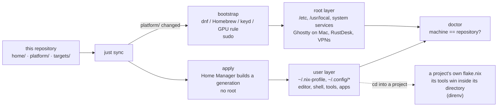

# environment

One repository that produces the same working environment on every machine:
Neovim, tmux, the shell, the terminal, and the tools around them. Linux and
macOS.

## TL;DR

**Get started** on a machine with nothing on it:

```bash
curl -fsSL https://raw.githubusercontent.com/agosmou/environment/main/bootstrap | bash -s -- --target workstation   # or: server
exec $SHELL -l
gh auth login                    # GitHub
uv python install                # Python, once
rustup default stable            # Rust, once
```

plus your git name and email in `~/environment/local/gitconfig.local`, and on
Fedora a log-out/log-in. `just doctor` tells you what is still missing.

**Maintain**, on every machine:

```bash
just sync       # pull, apply (or bootstrap when platform/ changed), doctor
```

**Change something**: edit a file under `home/` or `platform/`, then
`just check` and `just sync`. **Update everything**: `just update`, `just
check`, `just sync`, commit `flake.lock`. **Undo**: `just rollback`.




## Why It Is Shaped This Way

The goal is to open any computer and get to work, and never lose a day to a
broken environment.

1. So the environment has to be **reproducible**. Nix and Home Manager do
   that: this repository *is* the environment. Activating it builds every
   package and config file from these files, and the same files give the same
   result on any machine.
2. Reproducible cuts both ways. A mistake here is reproduced everywhere: a
   typo in a shell function breaks every new terminal on every machine that
   activates it. So the repository needs a way to be **known good** before it
   is applied.
3. That is `nix flake check`. One command that builds the environment for
   every target and runs the small checks in `flake.nix` (shell script lint,
   Neovim Lua parse). Those checks catch what Nix alone cannot see: Nix will
   happily install a script with a syntax error, because to Nix it is just a
   file.
4. CI runs the same command on a clean clone, on one runner per CPU and OS
   (x86 Linux, ARM Linux, Apple Silicon), so "works on my machine but I
   forgot to commit a file" is caught, and the Mac and ARM configurations
   are built and their tools run before any real machine gets them.

The daily loop is therefore: **edit, check, sync.**

## Quickstart

| I want to | Run |
|---|---|
| Set up a machine that has nothing on it | `curl -fsSL https://raw.githubusercontent.com/agosmou/environment/main/bootstrap \| bash -s -- --target workstation` (or `server`), then `exec $SHELL` |
| Bring any machine up to date | `just sync` |
| See a change I just made | `just check`, then `just sync` |
| Undo the last apply | `just rollback` |
| Know what this machine should have | `just inventory` |
| Know whether it actually does | `just doctor` |
| Add a command-line tool | a file under `home/shell/`, its import in `targets/`, `just sync` |
| Add a GUI app | `platform/fedora/packages` (Fedora) or `platform/darwin/Brewfile` (Mac), `just sync` |
| Start or enter a project with its own tools | see [docs/projects.md](docs/projects.md) |
| Update every package | `just update`, `just check`, `just sync`, commit `flake.lock` |

## New Machine

One command on a machine with nothing on it. Pick the line for the machine:

```bash
# Fedora workstation
curl -fsSL https://raw.githubusercontent.com/agosmou/environment/main/bootstrap | bash -s -- --target workstation

# Apple Silicon Mac
curl -fsSL https://raw.githubusercontent.com/agosmou/environment/main/bootstrap | bash -s -- --target workstation

# Linux server, x86 or ARM (a Pi)
curl -fsSL https://raw.githubusercontent.com/agosmou/environment/main/bootstrap | bash -s -- --target server
```

`workstation` and `server` resolve to the full target for the machine's CPU
and OS (`workstation-x86_64-linux`, `workstation-aarch64-darwin`,
`server-x86_64-linux`, `server-aarch64-linux`). The script installs Nix
(Fedora's own package on Fedora, the upstream nixos.org installer elsewhere),
clones this repository into `~/environment`, activates the target, and runs
the platform step for the OS.

Then four one-time steps. The first two put your identity on the machine and
are deliberately not in the repository, so it can be public.

1. **Log in to GitHub.** Opens a browser, stores a token in
   `~/.config/gh/hosts.yml`:

   ```bash
   gh auth login
   ```

2. **Tell git who you are.** Create this file with your name and email (the
   directory `local/` is gitignored):

   ```ini
   # ~/environment/local/gitconfig.local
   [user]
       name = Your Name
       email = you@example.com
   ```

3. **Download the runtimes the managers own.** Go, bun, and pnpm arrive
   installed. Python and Rust come through managers (uv, rustup) that
   download the actual interpreter or toolchain once per machine:

   ```bash
   uv python install        # the current Python; `uv python install 3.12` for a specific one
   rustup default stable
   ```

   `just doctor` reminds you until both are done. See
   [docs/projects.md](docs/projects.md) for why it is done this way.

4. **Fedora only: log out of GNOME and log back in.** The desktop session
   reads the Nix profile's paths at login, so until you do this, Nix-installed
   apps (Ghostty, the desktop apps) are missing from the app grid and
   Super-search, even though they run from a terminal. Once, after the first
   bootstrap.

### A machine that already has an environment

Home Manager takes over the files it manages and leaves everything else
alone. There is no merge and no silent overwrite:

- **A file it manages already exists** (`~/.bashrc`, `~/.config/nvim`, a
  Stow or `ln -s ~/dotfiles/...` symlink): the original is renamed to
  `<file>.pre-home-manager` and the managed file takes its place. Nothing
  from the old file is carried over. `just doctor` lists every such backup
  and stays red until you have moved what matters into the repository and
  deleted the backup. (Home Manager itself only backs up regular files and
  refuses on symlinks; `bootstrap` moves those aside first, including a
  symlinked directory such as `~/.config/nvim -> ~/dotfiles/nvim`, so the
  old dotfiles directory is never written into.)
- **Programs installed some other way** (`brew`, `dnf`, `apt`, `pip`, things
  in `~/.local/bin`) stay installed. `~/.nix-profile/bin` comes first on PATH,
  so the Nix version of a tool wins when both exist. On Fedora and macOS,
  `just doctor` reports packages outside the manifests as drift; removing them
  is always your call.
- **Config for tools this repository does not manage** is untouched.

So the sequence on an existing machine is: bootstrap, `just doctor`, work
through what it lists, done.

On a Mac that already had Homebrew, two more things come up, both reported
by doctor:

- **Command-line tools installed with `brew`** (neovim, git, tmux, uv, ...)
  are now duplicates: Nix owns the command line here and its copy is first
  on PATH. Doctor lists everything brew has that is not in the Brewfile;
  `brew bundle cleanup --force --file platform/darwin/Brewfile` removes it
  all in one go. Read the list first: anything on it you still want belongs
  in the repository (`home/`, or the Brewfile for a GUI app), not in brew.
- **A GUI app that was installed by hand** (dragged to /Applications) and is
  in the Brewfile is adopted by brew, which changes the bundle's group.
  macOS's App Management protection blocks that from a terminal that has not
  been granted it, and the install fails with `chgrp: ... Operation not
  permitted`. Once per terminal app: System Settings > Privacy & Security >
  App Management > enable it, then `just bootstrap` again.

The platform step is the only part that needs root, and it is small:

| OS | Declared in | Applied by |
|---|---|---|
| Fedora | `platform/fedora/packages` (dnf), `platform/fedora/keyd/` | `platform/fedora/bootstrap.sh` |
| Debian/Ubuntu servers | `platform/debian/packages` (apt) | `platform/debian/bootstrap.sh` |
| macOS | `platform/darwin/Brewfile` | `platform/darwin/bootstrap.sh` |

Everything else on a machine comes from Home Manager and needs no root.
That includes bash 5 on macOS (`home/common.nix`): the scripts in this
repository need it, Apple ships 3.2, and `#!/usr/bin/env bash` finds the
Nix one first.

GUI applications come from the most trustworthy build available for the
platform: Homebrew casks on macOS (they repackage the projects' official
builds); on Fedora, the vendor's own rpm for RustDesk, and nixpkgs for Ghostty,
which Fedora does not package itself. Nix owns the command line. The app's
*configuration* lives here either way and is written by Home Manager. See
[docs/nix.md](docs/nix.md), "GUI Apps".

## Layout

Every file in the repository, and what it is for.

| Path | What | Applied by |
|---|---|---|
| `flake.nix`, `flake.lock` | The entry point: inputs (nixpkgs, Home Manager) at pinned commits, the four targets, the checks | `just sync` |
| `targets/<name>/home.nix` | One file per machine type; lists exactly which modules it imports and its per-machine switches | `just sync` |
| `home/common.nix` | What every target shares: `just`, the recorded target name, the smoke-test registry | `just sync` |
| `home/shell/` | bash (Linux), zsh (Mac), shared aliases and functions, and one file per command-line tool: atuin, bat, btop, direnv, fastfetch, fzf, starship, zoxide, `tools.nix` for plain binaries | `just sync` |
| `home/dev/` | Language tooling, global: uv (Python), go + gopls, bun + pnpm, rustup + cargo-nextest, cloudflared + wrangler. A project's own flake wins inside its directory | `just sync` |
| `home/git/` | git with delta; gh | `just sync` |
| `home/ssh/` | ssh client config; Keychain on the Mac | `just sync` |
| `home/neovim/` | Neovim, its language servers, formatters and debuggers, the Lua config, the plugin lock | `just sync` |
| `home/tmux/` | tmux, its plugins, the session picker | `just sync` |
| `home/terminal/ghostty.nix` | Ghostty: config and font everywhere; the binary too on Fedora (nixpkgs), from Homebrew on the Mac | `just sync` |
| `home/desktop/` | Needs a screen; workstations only: GNOME settings (`gnome.nix`) and their macOS counterparts (`macos.nix`), Wayland clipboard, the keyd binary, music and chat apps (`apps.nix`) | `just sync` |
| `home/ai/` | OpenCode, Claude Code, Codex, and `skills/` shared by all three | `just sync` |
| `platform/fedora/packages` | dnf packages: Nix itself, RustDesk, ChatGPT/Codex, Mullvad, Tailscale. The root-level manifest for Fedora | `just sync` → bootstrap |
| `platform/fedora/baseline` | Packages the Fedora installer marks as user-installed; doctor ignores them when checking for drift | doctor |
| `platform/fedora/keyd/` | The Caps Lock remap and its systemd unit | `just sync` → bootstrap |
| `platform/fedora/battery.conf` | Charge limit (80%) as a tmpfiles rule | `just sync` → bootstrap |
| `platform/fedora/bootstrap.sh` | The Fedora root-level step: vendor repos, dnf, tailscaled, sshd, GPU rule, keyd, battery | `just sync` → bootstrap |
| `platform/debian/packages`, `platform/debian/bootstrap.sh` | The Debian/Ubuntu root-level step for servers: Tailscale's apt repo, apt packages, tailscaled | `just sync` → bootstrap |
| `platform/darwin/Brewfile` | Homebrew casks: Ghostty, RustDesk, Spotify, Slack, Discord, Obsidian, ChatGPT, Codex, Claude, Docker Desktop, Mullvad, Tailscale. The root-level manifest for the Mac | `just sync` → bootstrap |
| `platform/darwin/bootstrap.sh` | The macOS root-level step: Homebrew, the Brewfile | `just sync` → bootstrap |
| `bootstrap` | The one-command machine setup; also the root-level step `sync` runs when `platform/` changed | curl, or `just sync` |
| `justfile` | The commands: sync, check, doctor, inventory, rollback, update, and the steps they are made of | `just` |
| `scripts/doctor` | Compares the machine to the repository, both directions; read-only | `just doctor` |
| `scripts/inventory` | Prints everything a target declares; read-only | `just inventory` |
| `tests/bootstrap.sh` | Target-detection tests for `bootstrap` | `just check` |
| `.github/workflows/check.yml` | CI: `nix flake check` on x86 Linux, ARM Linux, Apple Silicon, from a clean clone | push |
| `docs/` | `nix.md` (how Nix works here, flakes, GUI apps), `neovim.md`, `tmux.md`, `remote-access.md` | — |

## Adding A Target

A target is `<role>-<nix-system>`: `workstation` or `server`, and one of
`x86_64-linux`, `aarch64-linux`, `aarch64-darwin`. To add one: create
`targets/<name>/home.nix` listing its imports and `custom.target`, register
it in `flake.nix` (`mkHome`, `homeConfigurations`, and a `checks` entry under
its system), and add it to the accepted list in `bootstrap`. Do not encode a
provider or distribution in the name: the same server configuration works
anywhere that CPU and OS run.

## Targets

| Target | Intended use |
|---|---|
| `workstation-x86_64-linux` | Fedora workstation |
| `workstation-aarch64-darwin` | Apple Silicon Mac |
| `server-x86_64-linux` | x86 Linux server |
| `server-aarch64-linux` | ARM Linux server |

Linux targets use bash; the Mac uses zsh. Both get the same aliases,
functions, prompt, and command-line tools from `home/shell/`, where every
tool is one file: `ls home/shell/` is the list of what is installed, and
removing a tool is deleting its file and its import line in `targets/`.

## Daily Loop

Editing a file under `home/` changes nothing on the machine by itself: the
repository is a description, and `apply` is what turns it into a new Home
Manager generation and points the home directory at it. So every change is:

```bash
# 1. edit something, e.g. add a package to home/shell/tools.nix
just check     # 2. does it build? lints, every target evaluates
just sync      # 3. make it real on this machine (apply, or bootstrap if platform/ changed)
```

The machine knows which target it is: the first bootstrap records it at
`~/.config/environment/target`, and every recipe reads that. Pass a target
explicitly only to work on another machine's configuration, e.g.
`just build server-aarch64-linux`.

To confirm the machine matches what the repository says (after an apply, or
on a machine you have not touched in a while):

```bash
just doctor
```

`just` alone lists every recipe.

## Keeping Any Machine Current

One command, on every machine:

```bash
just sync
```

It pulls, then decides from what changed since the commit last applied on
this machine: anything under `platform/` or in `bootstrap` itself means
root-level work, so it runs the bootstrap (sudo); otherwise it applies. Then
it runs doctor. No prompts, so two machines syncing the same commit end up
the same.

Local edits do not stop it: with uncommitted changes it skips the pull and
applies what is in the tree, committed or not. `just apply` is one step of
`sync`; there is no situation in normal use where you need it directly.

| Situation | Command |
|---|---|
| Any machine, any time | `just sync` |
| Just made an edit, want it live | `just check`, then `just sync` |
| First bootstrap on a new machine | the curl line above, then `exec $SHELL` once |

Nothing needs a re-login after a sync. A new alias or PATH entry shows up in
the next terminal you open, as with any dotfiles.

## When Something Is Wrong

Every apply creates a new generation and keeps the old ones, so a bad
apply is undone by going back one:

```bash
just rollback        # activate the previous generation; nothing is rebuilt
just generations     # see them all, newest first
```

The repository is unchanged by a rollback. Fix the file, `just check`,
`just apply` again. See [docs/nix.md](docs/nix.md) for what a generation is.

## Updating

Three kinds of thing get updated three ways:

| What | How | Cadence |
|---|---|---|
| Everything from Nix (the command-line tools, Neovim and its language servers, Ghostty on Fedora, the desktop apps on Linux) | `just update`, then the steps below | Once a month, or when you want a newer version of something |
| OS packages and GUI apps from the OS (`platform/`: Fedora's dnf packages, Homebrew casks) | The OS's own updater: `sudo dnf upgrade` on Fedora, `brew upgrade` on the Mac. Not pinned; `just sync` installs what is missing but does not upgrade | Whenever; Fedora also does this through Software |
| Runtimes that a manager downloads (Python via uv, Rust via rustup) | `uv python install` / `uv python upgrade`; `rustup update` | When a project needs a newer one |

The Nix side is the one with a lock: nothing changes version on its own,
because `flake.lock` pins the exact nixpkgs and Home Manager commits, so every
tool is the version nixpkgs-unstable had on the day the lock was written.
`just check`, CI, and `just rollback` make moving it low-risk:

```bash
just update          # rewrite flake.lock to the newest commits
just check
just apply
# use the machine for a bit
git commit flake.lock -m "Update nixpkgs and home-manager"
```

If the update broke something: `just rollback`, `git checkout flake.lock`,
`just apply`. Do this from a clean working tree so `flake.lock` is the only
change.

## Before Committing

```bash
just fmt             # format every .nix file
just secrets         # scan for anything that looks like a token
just check
```

Before the first apply on a new clone, `just` is not installed yet; run
recipes through the development shell: `nix develop -c just check`.

## What Is On A Machine

Everything a target installs is declared in exactly three places, split by
who needs root:

| Owner | Declared in | Applied by |
|---|---|---|
| Home Manager | `home/**.nix` | `just apply` |
| dnf (Fedora) | `platform/fedora/packages` | `just bootstrap` |
| Homebrew (macOS) | `platform/darwin/Brewfile` | `just bootstrap` |

`just inventory` prints all of it, evaluated from the flake rather
than from a hand-kept list: Home Manager packages, every file Home Manager
places in the home directory, the root-level manifest for that OS, and the
repository tree. `just doctor` compares the running machine against
the same declarations and fails on drift in both directions: declared but
missing, or installed by hand but not declared. Doctor only reports; nothing
is removed automatically.

To add or remove a tool, edit one of the three places and re-run the
matching command. Home Manager removes what is no longer declared; dnf and
Homebrew do not, so doctor lists the leftovers until you remove them.

## Read Next

- [docs/nix.md](docs/nix.md): where Nix puts things, how generations and
  rollback work, what a flake is and why the "experimental" features are on,
  and where the config files under `~/.config` come from.
- [docs/remote-access.md](docs/remote-access.md): SSH, RustDesk, and
  Tailscale between the machines, including the one-time steps per machine.
- [docs/tailscale.md](docs/tailscale.md): what Tailscale is, how it works,
  and everything it can do, with Tailscale's own docs for each claim.
- [docs/neovim.md](docs/neovim.md): how the editor config is laid out, how to
  add a plugin or language server, and the keys added on top of Kickstart.
- [docs/tmux.md](docs/tmux.md): keys and behaviour.
- [docs/projects.md](docs/projects.md): global language tools versus a
  project's own flake, direnv, and a template for starting a project.
